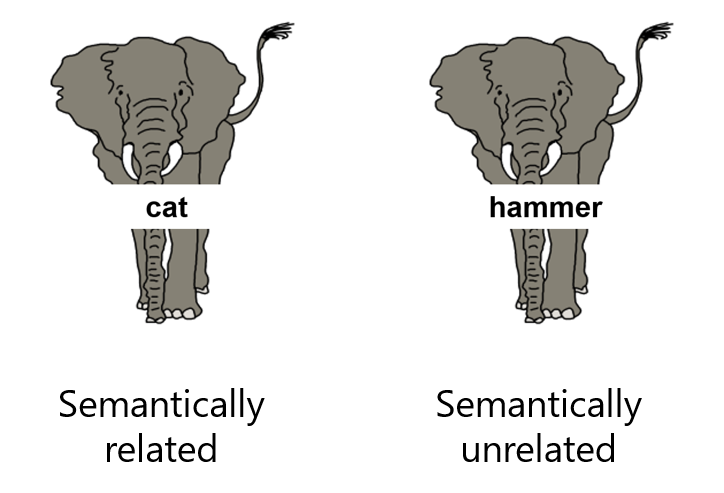

```{r setup, include = FALSE}
knitr::opts_chunk$set(echo = TRUE, message = FALSE, warning = FALSE)
```

> All models are wrong, but some are useful.
> `r tufte::quote_footer('Box (1979), p. 202')`

```{r, results = "hide"}
# remove all variables from the environment
rm(list=ls())
# load required packages
library("openxlsx")
library("Rmisc")
library("tidyverse")
library("lme4")
library("car")
library("MASS")
library("scales")
library("lmerTest")
library("sjmisc")
library("sjPlot")
library("ggsignif")
library("RColorBrewer")
library("broom.mixed")
```

# Linear models, t-tests, ANOVA... Different names, same foundation

In this session, we will work through a concrete example of analysing response time (RT) data, covering both the theoretical considerations and the practical steps involved in handling this type of data. At the same time, the session will illustrate a general workflow that can be applied to the analysis of any numerical dataset. But before we dive into the analysis, we will first place linear mixed-effects models in context to clarify why we need them in the first place and how they extend statistical tools you already know, such as t-tests, ANOVA, and ordinary least squares regression.

In statistics, we are often introduced to different tests and learn how they work and which types of data to apply them to, but we may lack an understanding of how they relate to one another. A t-test, ANOVA, and linear regression may seem like quite different procedures: they have different names, different test statistics, and are often introduced in separate chapters of textbooks. But in reality, most of the classical statistical tools we use for numerical data are variations on the same underlying idea: modelling a continuous outcome as a linear function of one or more predictors. They are all instances of the same *general linear modelling framework*.

So, what is a linear model?

At its simplest, a linear model relates a numeric outcome (e.g., fuel efficiency of a car) to one or more predictors (e.g., the car's weight). For example, in the `mtcars` dataset in R:

```{r}
data(mtcars)
head(mtcars)
```

```{r}
model1 <- lm(mpg ~ wt, data = mtcars)
summary(model1)
```

Conceptually, this model says:

$$
\begin{align}
\text{fuel efficiency} &= \text{fuel efficiency when weight is 0 (intercept)} \\
&\quad + \text{effect of weight (slope)} \times \text{weight}\\
&\quad + \text{deviation from prediction (residual)}
\end{align}
$$
The slope tells us how much fuel efficiency changes for each one-unit increase in weight. The model is estimated using *ordinary least squares (OLS)*, which chooses the intercept and slope to minimise the sum of squared differences between observed values and predicted values.

```{r, echo = F}
mtcars$mpg_pred <- predict(model1)

ggplot(mtcars, aes(x = wt, y = mpg)) +
  geom_point() +
  geom_line(aes(y = mpg_pred), color = "blue", linewidth = 1) +
    labs(x = "Weight (1000 lbs)",
       y = "Miles per gallon") + theme_classic() + scale_x_continuous(breaks = seq(1, 5.5, by = 0.5))
```

The plot above shows the actual data points (dots) and the predicted line (blue). If the model were perfect, all points would lie on the line. Since it cannot perfectly predict each observation, OLS chooses the line so that the overall squared vertical distances from points to the line are as small as possible, shown in red below: 

```{r, echo = F}
mtcars$mpg_pred <- predict(model1)

ggplot(mtcars, aes(x = wt, y = mpg)) +
  geom_point() +
  geom_line(aes(y = mpg_pred), color = "blue", linewidth = 1) +
  geom_segment(aes(x = wt,
                   xend = wt,
                   y = mpg,
                   yend = mpg_pred),
               colour = "red",
               arrow = arrow(length = unit(0.15, "cm"))) +
    labs(x = "Weight (1000 lbs)",
       y = "Miles per gallon") + theme_classic() + scale_x_continuous(breaks = seq(1, 5.5, by = 0.5))
```

Now what happens if our predictor is categorical, such as transmission (`am`, 0 = automatic, 1 = manual)?

```{r}
model2 <- lm(mpg ~ am, data = mtcars)
summary(model2)
```

The logic is the same:

$$
\begin{align}
\text{fuel efficiency} &= \text{mean fuel efficiency for the reference category (intercept)} \\
&\quad + \text{effect of transmission (slope)} \times \text{transmission type} \\
&\quad + \text{deviation from prediction (residual)}
\end{align}
$$
Because automatic cars are coded as 0 in the dataset, R automatically uses automatic cars as a reference category, so that the intercept becomes the mean fuel efficiency for automatic cars, and the slope becomes the difference for manual cars.

```{r, echo = F}
mtcars$mpg_pred2 <- predict(model2)

# Convert am to a factor for plotting
mtcars$am_f <- factor(mtcars$am, labels = c("Automatic", "Manual"))

ggplot(mtcars, aes(x = am_f, y = mpg)) +
  geom_point() +
  geom_point(aes(y = mpg_pred2), colour = "blue", size = 3) + # predicted values (group means)
  labs(x = "Transmission",
       y = "Miles per gallon") +
  theme_classic()
```

Adding residual arrows:

```{r, echo = F}
mtcars$mpg_pred2 <- predict(model2)

# Convert am to a factor for plotting
mtcars$am_f <- factor(mtcars$am, labels = c("Automatic", "Manual"))

ggplot(mtcars, aes(x = am_f, y = mpg)) +
  geom_point() +
  geom_point(aes(y = mpg_pred2), colour = "blue", size = 3) + # predicted values (group means)
  labs(x = "Transmission",
       y = "Miles per gallon") +
  theme_classic() + 
  geom_segment(aes(x = am_f, xend = am_f,
                   y = mpg, yend = mpg_pred2),
               colour = "red",
               arrow = arrow(length = unit(0.15, "cm")))
```

Like I said above, the slope in this model is basically the difference between manual and automatic cars. It turns out that testing whether the slope is zero in a linear model is mathematically identical to an independent-samples t-test!

```{r}
t.test(mpg ~ am, data = mtcars, var.equal = TRUE)
```

See? Same coefficient, same t-value, same p-value! So a t-test is simply a linear model with a single binary predictor.

Now, what if you had a predictor that is not binary but has three or more levels?

For instance, let's create a categorical variable based on weight by segmenting it into three equal bins for light, medium, and heavy:

```{r}
mtcars$wt_group <- cut(mtcars$wt, breaks = 3, labels = c("light", "medium", "heavy"))
model3 <- lm(mpg ~ wt_group, data = mtcars)
summary(model3)
```

Conceptually, the model is:

$$
\begin{align}
\text{fuel efficiency} &= \text{fuel efficiency for light-weight cars (intercept)} \\
&\quad + \text{effect of medium weight (slope 1)} \times \text{0/1} \\
&\quad + \text{effect of heavy weight (slope 2)} \times \text{0/1} \\
&\quad + \text{deviation from prediction (error)}
\end{align}
$$

```{r, echo = F}
mtcars$mpg_pred3 <- predict(model3)

# Plot
ggplot(mtcars, aes(x = wt_group, y = mpg)) +
  geom_point() +
  geom_segment(aes(x = wt_group, xend = wt_group,
                   y = mpg, yend = mpg_pred3),
               colour = "red",
               arrow = arrow(length = unit(0.15, "cm"))) +
  geom_point(aes(y = mpg_pred3), colour = "blue", size = 3) +  # predicted group means
  labs(x = "Weight group",
       y = "Miles per gallon") +
  theme_classic()
```

Now compare this to an ANOVA model:

```{r}
anova_model <- aov(mpg ~ wt_group, data = mtcars)
summary(anova_model)
```

The difference with ANOVA is that it partitions the total variability in `mpg` into two components: variability explained by group differences and residual variability within groups. The F-test asks whether the between-group variability is large relative to the within-group variability. If it is, this indicates that the groups differ overall, and then we can examine the individual group differences using regression coefficients, as we did with the linear model above. In other words, the overall F-test in ANOVA corresponds to testing whether the set of regression coefficients associated with `wt_group` jointly explain a significant portion of the variance in the outcome.

So, to sum up:

- A t-test is like a linear model with one binary predictor;

- A one-way ANOVA is like a linear model with one categorical predictor with more than two levels;

- Multiple regression is a linear model with several predictors (continuous and/or categorical).

The bottom line is that they are all estimated using OLS, rely on the same assumptions (the relantionship between the variables is linear, and the residuals are independent, homoscedastic, and normally distributed), and are basically just different expressions of the general linear model! So when we are learning these methods, we are not learning entirely new statistical machinery each time; we are learning different expressions of the same general linear model.

<div style="border: 2px solid #cc0000; padding: 10px; margin: 10px 0; background-color: rgba(255, 0, 0, 0.08);">

<strong>NOTE</strong>

You might wonder why we don't just use linear models all the time. Well, some people do (for example, me!). Historically, t-tests and ANOVA were used instead because, long before computers were widely available, they were easy to compute by hand — whereas linear models (especially with multiple predictors) were much more cumbersome. Over time, this became traditional, and journals started requiring authors to report t-test and ANOVA statistics, so these methods became standard conventions (e.g., F ratios).

At the same time, many people felt that t-tests and ANOVA provide an intuitive introduction to comparing means and understanding variance, and are easier for students to grasp than regression coefficients (would you agree? I personally think regression is often clearer!). Many also felt that reporting these tests is also simpler because a single F ratio summarises whether group differences are significant. Of course, you could disagree — in many cases we're actually interested in the differences between specific levels of a category, so the F ratio alone does not fully answer the research question.

Finally, some researchers argue that, although linear regression can do everything that t-tests and ANOVA do (and more!), for very simple designs its extra flexibility is often overkill, so it's easier to stick with the simpler, conventional tests.

The situation is now changing. Many universities still teach t-tests and ANOVA, but in real-world research these tests are used less and less. While it is important to understand how all these classical tests relate to one another, you can no longer manage without linear models — and in particular, without linear *mixed-effects* models. For modern data, especially when observations are not independent, it is essential that you know how to use them.</div>

So where do linear mixed-effects models fit?

Linear mixed-effects models extend the logic of ordinary linear regression to situations where observations are not independent. In the current `mtcars` dataset, we have one value per car, and these values are independent (e.g., the weight of a Mazda has nothing to do with the weight of a Porsche). However, if we had multiple measurements per car, this independence assumption would no longer hold: observations from the same car would likely be related.

Standard linear models, t-tests, or ANOVA assume that each observation is independent. Applying them directly in the presence of correlated data can underestimate variability and inflate statistical significance. Linear mixed-effects models address this by explicitly including random effects, which capture systematic differences across participants, stimuli, or other clusters, while still estimating the fixed effects of interest (e.g., experimental conditions). Conceptually, they are built on the same foundation as t-tests, ANOVA, and regression: the outcome is expressed as a combination of predictors plus error. The key difference is that mixed models acknowledge the hierarchical or repeated-measures structure of the data, allowing us to make valid inferences without oversimplifying the design.

Let us now look at how this works in practice. Before we begin, note that, in a typical research context, most of the analytical decisions we make are determined during the planning or pre-registration stage. Ideally, once data collection is complete, the task is simply to implement the decisions that were specified in advance. For the purposes of this session, however, we will assume that no such plan exists and will "pretend" to make these decisions from scratch in order to understand the reasoning behind them.

We will start by loading the dataset and exploring its structure and contents.

# Load and inspect data

```{r}
data <- read.csv("pwiExp_German.csv")
data$Cond <- as.factor(data$Cond)
```

This file contains data from an experiment in which native German speakers performed a *picture-word interference task*. Specifically, they viewed pictures of familiar concepts (e.g., elephant) with superimposed word distractors. Their task was to name the concept depicted in the picture as quickly and accurately as possible, while ignoring the distractor word.

There were three types of distractor words in this task:

- *Semantically related German words*: words that were related in meaning to the depicted concept (e.g., *Katze*, which means "cat" in German);

- *Semantically unrelated German words*: words that were unrelated in meaning to the depicted concept (e.g., *Hammer*, which means "hammer" in German);

- *Unknown pseudowords*: words that look like they could be German but do not actually exist (the baseline condition).

The image below illustrates how pictures with the first two types of distractors appeared. For clarity in the figure, the superimposed words are shown in English, but in the actual experiment they were presented in German.

<center>
{width=300px}
</center>

```{r}
head(data)
```

The dataset contains lots of information, but the relevant variables for us today are:

* `Subj`: Participant ID (60 participants in total)
* `Cond`: Condition, a factor with 3 levels: `SemRelG` (semantically related German), `SemUnRelG` (semantically unrelated German), `Baseline` (unknown pseudoword)
* `TargetAnswer`: expected response (i.e., correct picture name in German)
* `Response`: participant's actual response
* `Accuracy`: a factor with 2 levels, `0` = incorrect responses, `1` = correct responses
* `RT`: response times (in ms)

<div style="border: 2px solid #cc0000; padding: 10px; margin: 10px 0; background-color: rgba(255, 0, 0, 0.08);">

<strong>NOTE</strong>

At this point, you should inspect the dataset to verify that it appears as expected. For instance, you can use a function called `xtabs()` to ensure that you have the expected number of observations in each list and condition:

```{r, eval = F}
head(xtabs(~ Subj + List,data)) 
head(xtabs(~ Subj + Cond,data)) 
xtabs(~ List + Cond, data) 
```

In this example, I have already verified that the dataset looks as it should. In practice, however, this step is crucial and should never be skipped. A surprising number of analyses (and published papers) contain errors that could have been avoided with a simple data check at the outset!</div>

The picture-word interference task is a well-established paradigm for studying how people produce words. In this task, participants are typically slower to name a picture when a superimposed distractor word is familiar to them (as opposed to when it is unknown). Moreover, naming becomes even slower when the distractor word is semantically related to the depicted object (e.g., when the picture shows an animal and the distractor is the name of another animal).

In the present study, we want to examine whether this same pattern can be observed in our German dataset. Our research questions are therefore as follows:

<style>
div.blue{background-color:#e6f0ff; border-radius: 5px; padding: 20px;}
</style>
<div class = "blue">

1. Do German semantically unrelated distractors slow picture naming compared to unknown pseudowords?

2. Do German semantically related distractors slow picture naming compared to semantically unrelated German distractors?

</div>
<p>  </p>

In a task like this, it only makes sense to address these research questions using trials in which participants responded correctly (i.e., where they provided the correct name for the picture). We will therefore remove trials with incorrect responses before proceeding with the analysis:

```{r}
dataCorr <- data %>%
  filter(Accuracy == 1)
```

Now let us think about whether there are any other trials we need to exclude.

There are many ways to deal with "extreme" response times, and the best approach often depends on your research question and your understanding of the processes you are studying.

For example, in word production tasks, it often makes sense to remove extremely fast or extremely slow responses, as these are likely to reflect lapses in attention, accidental key presses, or other task-unrelated behaviour. But this raises an important question: how do we define "too fast" or "too slow"?

One approach is to rely on theoretical knowledge and common sense. For instance, if someone takes two minutes to name a simple picture, they are unlikely to be performing the task as intended. Similarly, a response within the first 100 ms after picture onset is implausible, because we know that visual processing and lexical retrieval require more time than that.

Another common approach is statistical: compute the average response time and exclude trials that fall, for example, more than three standard deviations away from the mean.

Personally, I prefer to retain as many observations as possible (unless I can be confident that certain responses are genuine errors) and to *model variability* where appropriate. In practice, this means combining subject-matter knowledge with visual inspection of the data distribution and removing only those data points that clearly stand out as implausible.

```{r}
plot(density(dataCorr$RT))
```

Here, based on the data distribution and what we know about picture naming, it makes sense to remove responses faster than 300ms and slower than 2000ms. However, before applying these cutoffs, we need to verify that they do not introduce systematic bias. In particular, we must ensure that exclusions are not disproportionately concentrated in one condition, as this could artificially create or inflate differences between conditions. In other words, trimming should remove "noise" rather than selectively removing valid observations from one experimental condition more than the other.

```{r}
ggplot(dataCorr, aes(x = RT, fill = Cond, color = Cond)) +
  geom_density(alpha = 0.3, adjust = 1) +
  labs(
    x = "Response Time (ms)",
    y = "Density") +
  theme_classic()
```

Looks fine!

```{r}
dataCorr2 <- dataCorr %>%
 filter(RT > 300 & RT < 2000)
```

This results in a loss of 12 data points, which is relatively minor. We are now ready to begin the analysis, and our first step will be to visualise the data and compute some descriptive statistics.

# Summary statistics and plots

In this experiment, each participant viewed multiple pictures per condition, so we have multiple responses from each person. Since we are not interested in their speed on individual trials but rather in their typical response in each experimental condition, we first group the data by subject and condition and then compute the mean response time for each participant in each condition.

```{r}
sum <- dataCorr2 %>%
  arrange(Subj, Cond) %>%
  group_by(Subj, Cond) %>%
  summarise(meanRT = mean(RT))

head(sum)
```

Now that we have calculated the average response time for each participant in each condition, we can examine overall performance at the group level. To do this, we aggregate these participant-level means by condition, allowing us to estimate how fast participants were, on average, in each condition across the entire sample.

Because this is a within-subject design in which each participant experiences all conditions, we cannot compute condition means by treating all observations as independent. Standard summary approaches (for example, the `summarySE` function) assume independence and therefore ignore the repeated-measures structure of the data. This would inflate the standard errors by including between-subject variability.

Instead, we should use the `summarySEwithin` function. This function is specifically designed for within-subject designs: it normalises the data to remove between-subject variability before computing standard errors, thereby providing appropriate within-subject error estimates.

It is worth noting that there is a known bug in `summarySEwithin` when a factor has only two levels. However, since our condition factor has three levels, this issue does not affect the present analysis.

```{r}
(RT <- summarySEwithin(sum, measurevar = "meanRT", withinvars = "Cond",
                       idvar = "Subj", na.rm = FALSE, 
                       conf.interval = .95))
```

Now we have the means, standard deviations, and standard errors of the mean, which can be used for reporting descriptive statistics or for creating plots!

The simplest way to visualise these data is to create bar plots, like so:

```{r}
ggplot(RT, aes(x = Cond, y = meanRT, fill = Cond)) +
  geom_bar(position = position_dodge(), stat = "identity",
           color = "black",
           size = .3) +
  geom_errorbar(aes(ymin = meanRT-se, ymax = meanRT+se),
                size = .3, width = .2,
                position = position_dodge(.9)) +
  xlab("Distractor condition") +
  ylab("Response time (ms)") +
  coord_cartesian(ylim = c(750,900)) +
  theme_classic() +
  theme(axis.title.x = element_text(size = rel(1.2), colour = "black"),
        axis.title.y = element_text(size = rel(1.2), colour = "black"),
        panel.background = element_rect(colour = "white"),
        axis.text = element_text(size = rel(1), colour = "black"),
        legend.text = element_text(size = rel(1), colour = "black"),
        legend.title = element_text(size = rel(1.2), colour = "black"),
        axis.line = element_line(colour = "black")) +
     scale_fill_manual(name = "Distractor condition", 
                     labels = c("Unknown pseudoword", "Related", "Unrelated"), 
                     values = c("#D95F02", "#440154FF", "#35B779FF")) + guides(fill = FALSE) +
  scale_x_discrete(labels = c("Unknown pseudoword", "Related", "Unrelated"))
```

Notice that the y-axis starts at 750 ms rather than 0. This is intentional because our effects are on the order of milliseconds. If the axis started at 0, the differences between conditions would be visually compressed and difficult to detect. By restricting the lower bound of the axis, we make the relevant variation in the data easier to see.

Another important point is that although this plot shows the means and one standard error of the mean, it does not provide information about the underlying distribution of the data. For example, we cannot see the spread of individual data points, the shape of the distribution, or whether the data are skewed.

For this reason, I personally find bar plots such as these somewhat limited (see [here](https://github.com/mariakna/SEDarc2025_Intro_to_Data_Vis_in_R) for a more detailed discussion on data visualisation). A more informative alternative is a *raincloud plot*, which combines several sources of information in a single visualisation: individual data points, the distribution shape (e.g., density), the mean, standard error, and summary statistics such as the median and quartiles.

```{r}
# load file containing the geom_flat_violin function
source('./geom_flat_violin.R')

ggplot(sum, 
       aes(x = Cond, y = meanRT, fill = Cond, color = Cond)) + 
  
  # add violins
  geom_flat_violin(position = position_nudge(x = .1, y = 0), 
                 trim = T, alpha = .5) + 
  
  # add individual data points
  geom_point(position = position_jitter(width = .05), 
           size = 0.75) + 
  
  # add the box-and-whiskers plot
  geom_boxplot(outlier.shape = NA, alpha = .5, 
            width = .1) + 
  
  # add means (on the violins)
  geom_point(data = RT, aes(x = as.numeric(Cond) +.1, 
                            y = meanRT), size = 2, shape = 18) +
  
  # add SEs (on the violins)
  geom_errorbar(data = RT, aes(x = as.numeric(Cond) + .1, y = meanRT,
                               min = meanRT-2*se, ymax = meanRT+2*se), 
                size = 0.75, width = .04) +
  
  # define text on the axes
  xlab("Distractor condition") +
  ylab("Response time (ms)") +
  
  # text size and colour
  theme_classic() +
  theme(axis.title = element_text(size = rel(1.2), colour = "black"),
        axis.text = element_text(size = rel(1), colour = "black"),
        axis.line = element_line(colour = "black"),
        legend.position = "none") +
  
  # define colours
  scale_fill_manual(values = c("#D95F02", "#440154FF", "#35B779FF")) +
  scale_color_manual(values = c("#D95F02", "#440154FF", "#35B779FF")) +
  
  # change condition labels on the x-axis
  scale_x_discrete(labels = c("Unknown pseudoword", "Related", "Unrelated"))
```

This plot now looks much nicer and is very informative. Note that I have plotted 2 SEs from the mean here, rather than 1 SE as in the previous plot. Using 2 SEs corresponds roughly to the 95% confidence interval and is visually more effective; with only 1 SE, the error bars would have been too small to see clearly.

We are now ready to begin the inferential analysis! But before we proceed, let's briefly revisit what a linear mixed-effects model is and why we use it. We will start with a reminder of what a simple linear model is and will gradually build up to the linear mixed-effects model.

# How do linear mixed-effects models work?

## Linear models with fixed terms only

A linear model is a statistical model that tries to predict one variable (the outcome) from one or more other variables (the predictors). In our case, for example, we want to predict response time from semantic relatedness.

The term *linear* means that the relationship between the predictors and the outcome is assumed to be additive and straight-line in form. In other words, each predictor contributes a certain amount to the outcome, and these contributions are added together. The effect of a predictor is assumed to be *constant* — for example, changing from "unrelated" to "related" is assumed to increase or decrease response time by a fixed amount.

A linear model also assumes that all observations are independent and come from the same population. This means that it ignores any grouping structure in the data (such as several responses coming from the same participant or item).

For example, if we are looking at response times and the effect of semantic relatedness for one participant, we could write:

$$
RT_n \sim \alpha + \beta \cdot Cond_n + \varepsilon
$$

where:

* $RT_n$ is the response time on trial *n* (i.e., how long it took the participant to name the picture on that trial);

* $\alpha$ is the *intercept*; this represents the average response time in the baseline condition (we'll discuss what "baseline" means in the next section);

* $Cond_n$ is the condition for trial *n* (e.g., whether the distractor word is related, unrelated, or a pseudoword);

* $\beta$ is the *slope*; this tells us how much the response time changes when we move from the baseline condition to another condition;

* $\varepsilon$ is the *residual*; this captures everything the model does not explain, such as random noise or other influences on response time.

The parameters $\alpha$ and $\beta$ are called *fixed effects* because they are shared by all observations. 

To reiterare, this model treats all observations as independent, ignoring the fact that responses are grouped by subjects or items. In other words, it "pools" all data together (for this reason, this model is often called the *complete pooling* model). However, in our experiment, observations are not truly independent:

* Each participant contributes multiple responses to each condition; 
* Each item (i.e., each picture) is seen by multiple participants.  

If we ignore this structure, our model may underestimate variability, overstate confidence in the estimates, and fail to capture systematic differences between participants or items. To handle this, we can add *random effects*, which let the model account for differences between participants or items.

Models that include these random effects are called *partial pooling* models because information is shared across participants and items, while still allowing them to differ from one another. There are different types of partial pooling models depending on what random terms we include.

## Uncorrelated varying intercepts and slopes for participants

The key idea here is that responses produced by a given participant are likely to share common characteristics. For example, if a participant is generally very fast, most of their response times will tend to be faster than the overall average across all participants.

One way to account for this shared variance is to allow the intercept to vary across participants — that is, to include a participant-specific adjustment to the overall intercept:

$$
RT_n \sim \alpha + u_{subj[n]} + \beta \cdot Cond_n + \varepsilon
$$

Here, $u_{subj[n]}$ is the participant-specific adjustment to the overall intercept $\alpha$. In other words, each participant's baseline response time is $\alpha + u_{subj[n]}$ (often called a *random intercept*), where $u_{subj[n]}$ captures how much that participant differs from the average. 

In `lme4` syntax: `RT ~ Cond + (1 | subj)`.

The same idea applies to the effect of condition. Some participants might be more influenced by whether the distractor is related or unrelated than others. To account for this, we can adjust the slope for each participant so that the fixed effect $\beta$ would represent the average effect, while the participant-specific adjustment $w_{subj[n]}$ would capture how much each participant's effect differs from the average. This would create a so-called *random slope*:

$$
RT_n \sim \alpha + u_{subj[n]} + (\beta + w_{subj[n]}) \cdot Cond_n + \varepsilon
$$

By having included the adjustments to both the intercept and the slope for each participant, we are now accounting for the fact that each participant can have their own average response time, and that the effect of condition can vary across participants.

In `lme4` syntax: `RT ~ Cond + (1 + Cond || subj)`.

These adjustments capture systematic variation across participants and items and are called *random effects*.

## Uncorrelated varying intercepts and slopes for participants and items

Everything we've just discussed for participants also applies to items. Just as some participants are faster or slower on average, some pictures may be easier or harder to process, so that certain pictures are named more quickly while others take longer. Similarly, the effect of the experimental manipulation might vary across pictures — some depicted concepts may show a larger difference in response times between related and unrelated conditions. For these reasons, it makes sense to allow our model to include varying intercepts and slopes not just for participants, but also for items.

Let's start by adding the varying intercepts for items first:

$$
RT_n \sim \alpha + u_{subj[n]} + u_{item[n]} + (\beta + w_{subj[n]}) \cdot Cond_n + \varepsilon
$$

where the newly added term $u_{item[n]}$ represents the item-specific adjustment to the overall mean response time, capturing how much that particular picture tends to be named faster or slower than the average.

In `lme4` syntax: `RT ~ Cond + (1 + Cond || subj) + (1 | TargetAnswer)`.
  
Similarly, we can add the item-specific adjustments to the slope:

$$
RT_n \sim \alpha + u_{subj[n]} + u_{item[n]} + (\beta + w_{subj[n]} + w_{item[n]}\big)\cdot Cond_n + \varepsilon
$$

To summarise, our model now includes four random terms:

* $u_{subj[n]}$ — the by-participant adjustment for the intercept;
* $w_{subj[n]}$ — the by-participant adjustment for the slope; 
* $u_{item[n]}$ — the by-item adjustment for the intercept;
* $w_{item[n]}$ — the by-item adjustment for the slope.

This equated to `RT ~ Cond + (1 + Cond || subj) + (1 + Cond || TargetAnswer)`.

This looks great: our model is now much more flexible than the complete pooling model and accounts for multiple sources of variability. However, it currently assumes that the varying intercepts and slopes are independent. In other words, it assumes that there is no systematic relationship between a participant's average response speed and how strongly the experimental manipulation affects them. While this might sometimes be reasonable, it's also possible that participants who respond faster or slower tend to show stronger or weaker effects.

Similarly, the model assumes that there is no systematic relationship between how quickly a picture is named on average and how much the relatedness of the superimposed distractor affects the naming of that picture. Again, while this assumption may hold, it is also plausible that such a relationship exists.

For these reasons, it makes sense to allow the model to account for these possibilities. We can do so by adding correlation coefficients $\rho_{subj}$ and $\rho_{item}$, which capture whether participants with higher baseline response times tend to show stronger or weaker effects of the condition, and whether items that take longer to name also show stronger (or weaker) effects of relatedness.

## Correlated varying intercepts and slopes for participants and items

To account for correlations between intercepts and slopes, we don't need to change the likelihood function from the model with uncorrelated varying intercepts and slopes. What we do need to do is define two variance-covariance matrices — one for participants and one for items — which describe how the intercepts and slopes co-vary. These are assumed to follow a bivariate normal distribution.

For participants, this looks like so:

$$
\begin{pmatrix}
u_{subj,i} \\
w_{subj,i}
\end{pmatrix}
\sim
Normal\!\left(
\begin{pmatrix}
0 \\
0
\end{pmatrix},
\begin{pmatrix}
\sigma^2_{u_{subj}} & \rho_{subj}\,\sigma_{u_{subj}}\sigma_{w_{subj}} \\
\rho_{subj}\,\sigma_{u_{subj}}\sigma_{w_{subj}} & \sigma^2_{w_{subj}}
\end{pmatrix}
\right)
$$

Here, $\rho_{subj}$ captures the correlation between the participants' baseline response times and the strength of the condition effect.

Likewise, for items:

$$
\begin{pmatrix}
u_{item,j} \\
w_{item,j}
\end{pmatrix}
\sim
Normal\!\left(
\begin{pmatrix}
0 \\
0
\end{pmatrix},
\begin{pmatrix}
\sigma^2_{u_{item}} & \rho_{item}\,\sigma_{u_{item}}\sigma_{w_{item}} \\
\rho_{item}\,\sigma_{u_{item}}\sigma_{w_{item}} & \sigma^2_{w_{item}}
\end{pmatrix}
\right)
$$

Here, $\rho_{item}$ captures whether pictures that are slower or faster to name on average also tend to show stronger or weaker effects of relatedness.

In this model, we therefore allow both participants and items to vary in their baseline response times and in how strongly they are affected by the experimental manipulation, while also allowing these two sources of variation to be systematically related.

Don't worry about the complex formulas! In practice, when using packages like `lme4` in R, this correlation structure is handled "under the hood", so you never need to define it yourself — you just "tell" R whether you want it included. This is indicated in the syntax by using either one or two vertical bars between the grouping factor and the terms for the intercept and slope:

* If you write `RT ~ Cond + (1 + Cond | subj)`, R automatically estimates the variances of the intercepts and slopes *and* their correlation;

* If you write `RT ~ Cond + (1 + Cond || subj)`, R estimates the variances but does *not* estimate the correlation.

This gives you control over whether to model correlations while keeping the syntax simple.

A model like this is often called the *maximal model* in the frequentist framework (because it has a maximal random-effects structure for the location parameter, i.e., the mean). That said, it is important to remember that "maximal" here refers to maximal within the framework of the specified regression model. It does not mean "maximal" with respect to the full data-generating process. For example, such a model still does not account for factors like selection bias, time-related changes, measurement error beyond the residual term, or other sources of variation that lie outside the experimental design.

Ideally, we would always apply a maximal model to our data — that is, as long as the design of the study allows this! This is a very important point because not all study designs allow for a maximal random-effects structure. For example, if each participant sees only one level of the experimental condition, it is not possible to estimate a random slope for that condition by participant, because there is no within-participant variation in the predictor. Similarly, if an item appears in only one condition, the effect of condition cannot vary across items. In such cases, the random-effects structure must be simplified to reflect what can be supported by the data, while still capturing the most important sources of variability.

In the present experiment, each participant is exposed to all conditions (related, unrelated, baseline), and each image is shown in all conditions. Therefore, in principle, the design is appropriate for fitting a maximal model.

# Contrast coding

Contrast coding is a way of representing categorical variables (like the variable `Cond` in our experiment) numerically so that they can be included in a regression model. Instead of simply labeling conditions as 0, 1, 2, etc., contrast coding defines meaningful comparisons between the conditions, such as comparing each condition to a baseline or comparing the average of some conditions against others.

We need contrast coding because the way we code our categorical variables directly affects how the model interprets the effects and how we can interpret the resulting estimates. Using appropriate contrasts ensures that the model tests exactly the hypotheses we care about and that the coefficients have a clear and meaningful interpretation.

Let us recall what the research questions were for this experiment:

<style>
div.blue{background-color:#e6f0ff; border-radius: 5px; padding: 20px;}
</style>
<div class = "blue">

1. Do German semantically unrelated distractors slow picture naming compared to unknown pseudowords?

2. Do German semantically related distractors slow picture naming compared to semantically unrelated German distractors?

</div>
<p>  </p>

How can we test these hypotheses?

1. Separate models: We could fit two separate models: one testing the first hypothesis (contrast between semantically unrelated and unknown pseudoword distractors) and another testing the second hypothesis (contrast between semantically related and unrelated distractors).

2. Single model: We could fit one model that tests both hypotheses (and contrasts) simultaneously.

Both approaches are valid, but in either case we need to set contrasts, which specify the exact comparisons we want the model to make. We will now look at how to do both options and see why understanding contrast coding is essential for correctly testing our hypotheses.

## Option 1: Treatment vs. sum contrasts 

If we choose option 1 and test the two hypotheses separately, it makes sense to first restrict the dataset to only the data points that are relevant for each hypothesis. The process is the same for both hypotheses, so let's work with hypothesis 2. This means we should restrict our dataset to trials with semantically related and unrelated distractors:

```{r}
dataOpt1 <- dataCorr2 %>%
  filter(Cond == "SemRelG" | Cond == "SemUnRelG")
```

Let's see how the variable `Cond` is coded per default:

```{r}
levels(dataOpt1$Cond)
```

Interesting! We have restricted the dataset to only include rows with `SemRelG` and `SemUnRelG`; however, the variable `Cond` still has three levels. The first thing we need to do is adjust the levels of `Cond` so that it only includes the two relevant conditions. This step is important because most modeling functions will still treat the variable as having three levels unless we explicitly drop the unused one.

```{r}
dataOpt1$Cond <- factor(dataOpt1$Cond)
levels(dataOpt1$Cond)
```

Now imagine that we know nothing about contrast coding and simply fit the model without giving it much thought — which unfortunately often happens in publications (for now, don't worry about including random effects):

```{r}
model1 <- lm(RT ~ Cond, data = dataOpt1)
round(summary(model1)$coef,3)
```

How does R arrive at these particular values for the intercept and the slope? We can find out by inspecting the current contrasts of the factor `Cond`:

```{r}
contrasts(dataOpt1$Cond)
```

What you're seeing is the default option in R, called *dummy coding*. In this approach, factors are coded using *treatment contrasts*, where the factor levels are ordered alphabetically. As a result, the level `SemRelG` is coded as 0 and the level `SemUnRelG` is coded as 1.

Now, what does that mean for our model?

$$
RT \sim \alpha + \beta \cdot Cond 
$$ 
Let's insert the values from the model into the formula above:

$$
RT_{Related} = 847 - 0*27 = 847\\
RT_{Unrelated} = 847 - 1*27  = 820
$$ 

* The intercept $\alpha$ is the estimated mean response time for `SemRelG` (because it is coded as 0, it is treated as the reference level, or baseline); 

* The slope $\beta$ is the estimated difference between the means of the two conditions (i.e., `SemUnRelG` − `SemRelG`). The slope is negative because response times are slower in `SemRelG`.

To summarise, the intercept in treatment coding represents the average response in the baseline condition (in this case, the semantically related condition), while the slope tests the difference between the condition means. This also means that the intercept corresponds to a null hypothesis that is typically not of interest — namely, that the mean RT in condition `SemRelG` is 0:

$$
H_0: \alpha = 0
$$

... while the null hypothesis for the slope is that the difference between the baseline and the other condition is 0:

$$
H_0: \beta = \mu_{Related} - \mu_{Unrelated} = 0
$$

This contrast coding reflects comparison we would like to make with regards to the slope, but not the intercept, and it also does not align with our theoretical understanding of how cognitive processes operate (mean response time cannot be zero). A better option therefore would be to use *sum contrasts* instead, which means coding the factor levels so that they are compared to the overall (grand) mean rather than to a single baseline level. In other words, with sum contrasts, the intercept represents the grand mean across conditions, and the slope represents how much each condition deviates from that grand mean.

In principle, it does not matter which numerical codes we assign to the conditions, as long as they sum to zero and we understand how this coding affects the interpretation of the parameters. In other words, what matters is not the specific numbers themselves, but how they determine the meaning of the intercept and the slope.

For simplicity, we will begin with sum contrasts coded as −1 and +1:

```{r}
contrasts(dataOpt1$Cond) <- c(-1, 1)
contrasts(dataOpt1$Cond)
```

Note that  you can also create a separate variable that contains values -1 and 1 if you prefer and use that instead:

```{r}
dataOpt1$Condition <- ifelse(dataOpt1$Cond == "SemRelG", -1, 1)
```

Now, `SemRelG` is coded as -1 and `SemUnRelG` is coded as 1. What do the intercept and the slope represent now?

```{r}
model2 <- lm(RT ~ Cond, data = dataOpt1)
round(summary(model2)$coef,3)
```

$$
RT_{GrandMean} = 834 - 0*14 = 834\\
RT_{Related} = 834 + 1*14  = 848\\
RT_{Unrelated} = 834 - 1*14  = 820\\
$$

* The intercept $\alpha$ is now the average of the two conditions (834ms);

* The slope $\beta$ is now *half* the difference between the two condition means (i.e., `SemUnRelG`-`SemRelG`), meaning that the estimated difference between the two conditions is around $14*2 = 28$, which corresponds to what we've seen in the descriptive summary above:

```{r}
RT
```

Let's go through this step by step to make sure we understand what's happening here.

With sum contrasts of -1 and +1, the linear model is:

$$
RT = \alpha + \beta X
$$
where

$$
X =
\begin{cases}
-1 & \text{for Related} \\
+1 & \text{for Unrelated}
\end{cases}
$$
Let's solve this equation separately for each level of `Cond`:

$$
\mu_{\text{Related}} = \alpha - \beta \cdot 1 = \alpha - \beta
$$
and

$$
\mu_{\text{Unrelated}} = \alpha + \beta \cdot 1 = \alpha + \beta
$$
This means that...

$$
\mu_{\text{Related}} + \mu_{\text{Unrelated}} = (\alpha - \beta) + (\alpha + \beta) = \alpha + \alpha = 2 \alpha
$$
and, consequently, the intercept $\alpha$ is the mean of the two conditions:

$$
\alpha = \frac{\mu_{Related} + \mu_{Unrelated}}{2}
$$
Now what is the difference between the two conditions?

$$
\mu_{\text{Related}} - \mu_{\text{Unrelated}} = (\alpha - \beta) - (\alpha + \beta) = -\beta - \beta = -2 \beta
$$
In other words, $\beta$ is now half the difference between the two condition means:

$$
-\beta = \frac{\mu_{\text{Related}} - \mu_{\text{Unrelated}}}{2}
$$
and

$$
\beta = \frac{\mu_{\text{Unrelated}} - \mu_{\text{Related}}}{2}
$$
This also explains why the beta coefficient has a negative sign in the model.

Personally, I find it much easier to interpret model output when using sum contrasts if I don't have to remember to multiply the slope coefficient by 2. I have also seen many papers where this step seems to have been overlooked.

To avoid this issue altogether, one can use 0.5 and -0.5 for the contrast coding instead of 1 and -1. With this scaling, the slope directly corresponds to the full difference between conditions, so you don't need to perform any additional multiplication.

To summarise:

<style>
div.blue{background-color:#e6f0ff; border-radius: 5px; padding: 20px;}
</style>
<div class = "blue">

* Treatment contrasts compare one or more condition means to a baseline condition (which, in R, is chosen arbitrarily by default based on alphabetical order unless specified otherwise);

* Sum contrasts compare each condition mean to the grand mean. With only two conditions, this effectively tests whether the two condition means differ from one other.

</div>
<p>  </p>

The key point here is not that one type of contrast coding is inherently superior to another, but that if we are unaware of which contrast coding is being used, we cannot be certain what the model coefficients actually represent. For this reason, it is critical to set the contrasts explicitly.  

It is also good practice to choose contrasts that align with our hypotheses and the design of the study. This ensures that the model's results directly address our research questions, without requiring additional analyses to extract the values we are interested in.  

That said, having a preference for one type of contrast over another is perfectly fine, as long as you clearly understand what your model is doing.

## Option 2: Sum contrasts for a factor with 3 levels

Let us now consider how we can test the two contrasts — *unrelated vs. unknown* and *related vs. unrelated* — within a single model. Recall that the unknown pseudowords were used as the baseline condition; this is why the corresponding trials are coded this way in the data. Below, I will refer to the unknown pseudowords simply as *Baseline*.

Contrast 1:

$$
H_0: \mu_{Unrelated} - \mu_{Baseline} = 0
$$

Contrast 2:

$$
H_0: \mu_{Unrelated} - \mu_{Related} = 0
$$

Because we now have three conditions, the null hypothesis for the intercept becomes that the grand mean *across all three conditions* is 0:

$$
H_0 = \frac{\mu_{Unrelated} + \mu_{Related} + \mu_{Baseline}}{3} = \frac{1}{3} \mu_{Unrelated} + \frac{1}{3} \mu_{Related} + \frac{1}{3} \mu_{Baseline} = 0
$$

We can summarise this as follows:

| Cond      | Contrast 1  | Contrast 2  | Intercept |
|-----------|-------------|-------------|-----------|
| SemRelG   | 0           | 1           | 1/3       |
| SemUnRelG | -1          | -1          | 1/3       |
| Baseline  | 1           | 0           | 1/3       |

... and store in a *hypothesis matrix*:

```{r}
(fractions(t(matrix <- rbind(int = 1/3, 
                       c1 = c(Baseline = 1, SemRelG = 0, SemUnRelG = -1),
                       c2 = c(Baseline = 0, SemRelG = 1, SemUnRelG = -1)))))
```

To obtain the contrast matrix needed to test these hypotheses in a linear model, the hypothesis matrix must be inverted. In simple terms, matrix inversion is a mathematical operation that "reverses" a matrix, similar to how dividing by a number reverses multiplication. This allows us to transform our hypothesis statements into the format that a linear model can use to estimate coefficients. You don't need to worry about the math behind this right now, but for more details, see [Friendly et al., 2018](https://cran.r-project.org/web/packages/matlib/vignettes/ginv.html) and [Schad et al., 2019](https://arxiv.org/abs/1807.10451).  

For now, just know that there is a function called `ginv`, and another function called `ginv2` that formats the output of `ginv` for easier use. You can use the code below whenever you need to invert a hypothesis matrix:

```{r}
# function that formats the output of ginv():
ginv2 <- function(x)
 fractions(provideDimnames(ginv(x), base = dimnames(x)[2:1]))
# Invert matrix:
matrix2 <- ginv2(matrix)
```

Let's look at what the matrix looks like now:

```{r}
matrix2
```

The first column of the inverted matrix represents the intercept, while the remaining two columns correspond to the two contrasts we have defined. We now need to assign both contrasts to the variable `Cond` so that the model knows how to interpret it.  

Note that we don't actually need the intercept column for our purposes, since all we care about are the two contrasts:

```{r}
(contrasts(dataCorr2$Cond) <- matrix2[, 2:3])
```

Let's now fit the model and include random effects to see how this works:

```{r}
m0 <- lmer(RT ~ Cond + (1 + Cond||Subj) + (1 + Cond||TargetAnswer), data = dataCorr2)
```

As you can see, we are getting singularity warnings and convergence errors — don't worry about these for now; we'll address them later. The goal at this stage is simply to understand the syntax and what the model is doing.

So, in the model above:

* `RT ~ Cond` says we are predicting response time (RT) from the variable `Cond`;

* `(1 + Cond || Subj)` specifies random intercepts and slopes for each subject (`Subj`) without correlation between them (the `||` notation);

* `(1 + Cond || TargetAnswer)` does the same for each item (picture).

The result `m0` is a model object that contains all the fixed and random effects estimates, as well as the model matrix internally.

Let's examine the model's output:

```{r}
round(summary(m0)$coef,3)
```

In this type of model, the random effects are stored as categorical variables, with each level of the factor representing a separate group. This is called a *factor-based approach*.

An alternative is to represent each random effect numerically as a vector, which allows the model to perform calculations directly on the numeric values of the contrasts rather than treating them as separate categories. This is called a *vector-valued approach*.

The vector-valued approach is very powerful because it provides greater flexibility. Let me demonstrate how we can move from a factor-based to a vector-valued representation.

The first step is to extract the model matrix:

```{r}
mat <- model.matrix(m0)
head(mat)
```

`model.matrix(m0)` creates a numerical matrix of predictors (also called the design matrix) that the model actually uses to estimate coefficients. Each column in the matrix corresponds to one predictor in the model, including the intercept and the contrasts, and each row corresponds to an observation in your dataset.

Once we have this matrix, we can add new variables to our dataset — one for each contrast we want to test — and assign the corresponding values from the matrix to these variables:

```{r}
dataCorr2$Bas.SemUnRel <- mat[, 2]
dataCorr2$SemRel.SemUnRel <- mat[, 3]
```

We have now created numeric representations of our contrasts, which can be interpreted independently in the model. Let's take a look at these new columns:

```{r}
dataCorr2[1:5,18:ncol(dataCorr2)]
```

What this means is that we can now fit our model like so:

```{r}
mod1 <- lmer(RT ~ Bas.SemUnRel + SemRel.SemUnRel +
                (1 + Bas.SemUnRel + SemRel.SemUnRel||Subj) + 
                (1 + Bas.SemUnRel + SemRel.SemUnRel||TargetAnswer), dataCorr2)
```

Now that we've determined the structure of our model, let us consider its assumptions and whether our data meet them.
 
# Model assumptions and data transformations

The core assumption of linear mixed-effects models is that the residuals and random-effect coefficients are independent, follow the same distribution (i.e., they are identically distributed), and are approximately normally distributed. If this assumption is strongly violated, the model may not be appropriate for the data.

Let's now examine the assumptions of our model. We can do this by plotting a histogram of the residuals to see their overall distribution:

```{r}
hist(residuals(mod1))
```

We can also create a quantile-quantile (QQ) plot:

```{r}
qqPlot(residuals(mod1))
```

A QQ plot is a scatterplot in which two sets of quantiles are plotted against each other. The two sets of quantiles are the theoretical quantiles — these are the quantiles you would expect if the data perfectly followed a particular distribution (normal distribution is the default for the `qqplot()` function) — and the sample quantiles, which are the quantiles calculated from your actual data (in this case, the residuals from your model). If both sets of quantiles come from the same distribution, the points should fall roughly along a straight line. You can also use `qqnorm()` for the same purpose.

In our case, it would seem that the model residuals have more extreme values than would be expected if they were normally distributed. Why is this happening? We can't be certain yet, but one possible reason could be that our dependent variable is not normally distributed. Linear mixed-effects models do not require the DV itself to be perfectly normal. However, when the DV is not normal, this often causes the residuals to also deviate from normality, which, in turn, violates the model assumptions.

```{r}
hist(dataCorr2$RT)
```

How can we deal with non-normal residuals? There are two main options:

1. Transform the data so that it better satisfies the model assumptions.  
2. Use a *generalised* linear mixed-effects model with a distribution that is more appropriate for the data.

There is an ongoing debate about which approach is best.

Many of the arguments for transforming raw response times relate to the core properties of RT distributions (see [Schramm & Rouder, 2019](https://psyarxiv.com/9ksa6/)):

1. RTs are unimodal but skewed, with a long upper tail;

2. Experimental manipulations that slow RTs tend to increase both the mean and standard deviation, with relatively small effects in the skewed tail. While distributions like Gamma, inverse Gaussian, ex-Gaussian, ex-Wald, lognormal, Weibull, or Gumbel can model this, the normal distribution cannot;

3. There is often high trial-by-trial and participant-to-participant variability, making effects across conditions harder to detect.

Due to these properties, many statisticians believe that transformations may help reduce skewness (by minimising the impact of outliers) and stabilise variance by maintaining good power. This, in turn, means that transformations might make it easier to assess small effects. 

However, others think that it's exactly these properties of RTs that mean that transforming them might not be the best idea:

- RT distributions are always shifted away from zero, and transforming them can radically change the shape and scale of the distribution.

- Variance often depends on this shift, so a transformation that works in one paradigm may not work in another.

Instead, these researchers suggest running both raw and transformed analyses and considering an effect significant only if both analyses agree (e.g., [Brysbaert & Stevens, 2018](https://www.ncbi.nlm.nih.gov/pmc/articles/PMC6646942/)). Others advocate analysing raw RTs with *generalised* linear mixed-effects models (GLMMs) instead (e.g., [Lo & Andrews, 2015](https://www.frontiersin.org/articles/10.3389/fpsyg.2015.01171/full)). In either case, it is important to remember that the choice of the distribution can carry cognitive interpretations because it reflects assumptions about the underlying data-generating process (e.g., [De Boeck & Jeon, 2019](https://www.frontiersin.org/articles/10.3389/fpsyg.2019.00102/full)).

It is beyond the scope of this session to discuss this in depth. In the following sections, I will show you how to analyse these data both with transformed and raw RTs. 

# Fitting the model

## Option 1 (transformed RTs)

The easiest way to determine whether the dependent variable needs a transformation, and which transformation is most appropriate, is to run a Box-Cox test on the model. Note that the random-effects structure does not matter in this case, so it is easiest to apply the test to a linear model with just the fixed-effects structure of interest. Also, keep in mind that the Box-Cox test does not work on `lmer` outputs.

```{r}
boxcox(model2)
```

The Box-Cox test produces a range of $\lambda$ values (often from -2 to 2) with corresponding log-likelihoods. These log-likelihoods measure how well the transformed dependent variable satisfies the assumptions of a linear regression model. The suggested transformation is the $\lambda$ that maximises the log-likelihood, meaning it makes the residuals as close as possible to being normally distributed with constant variance.

* $\lambda = 0$ suggests log transformation;
* $\lambda = 1$ means that no transformation is needed;
* $\lambda = 2$ means square transformation;
* $\lambda = -1$ means reciprocal (inverse) transformation;
* $\lambda = -2$ means reciprocal square trasnformation.

The dotted lines to the left and right of the central line represent the 95% confidence interval for lambda.

In our case, the lambda value falls near -1, suggesting that an inverse transformation is most appropriate.

The inverse transformation replaces the original variable $y$ with $1/y$ with the aim to reduce the influence of large values. Because we are working with response times, we apply the inverse transformation in a specific way: we flip the sign so that smaller original values (faster responses) correspond to higher transformed values, reflecting better performance, and we multiply by a scaling factor (10,000) to make the resulting numbers easier to work with, given that response times in milliseconds  range from 300 to 2,000. The code below creates a new column called `transRT` in the dataset which represents the transformed RTs:

```{r}
dataCorr3 <- dataCorr2 %>%
  mutate(transRT = -10000/RT)
```

To make sure this solves our problem, we fit the model again, this time on inverse RTs, and check its residuals:

```{r}
mInv <- lm(transRT ~ Cond, data = dataCorr3)
hist(residuals(mInv))
qqPlot(residuals(mInv))
```

Looks much better! Now we are ready to fit the model.

<div style="border: 2px solid #cc0000; padding: 10px; margin: 10px 0; background-color: rgba(255, 0, 0, 0.08);">

<strong>A note on model building</strong>

In addition to considering whether your study design permits a maximal model, you also need to consider whether your data can realistically support it. Maximal models include multiple random effects and their correlations, and estimating these parameters reliably requires sufficient observations at each relevant level (i.e., enough participants and enough items).

When the data are too sparse relative to the complexity of the model, estimation becomes unstable. This can lead to convergence warnings, singular fits, or parameter estimates that are technically produced but not trustworthy. In such cases, the model may be overparameterised for the available data.

In practice, datasets are often not large enough to support the estimation of correlations between random intercepts and random slopes. For this reason, researchers sometimes simplify the random-effects structure while aiming to preserve the theoretically important variance components.

There are two main approaches to model building/simplification (e.g., [Schad et al., 2019](https://arxiv.org/abs/1904.12765)):

1. Start with a *minimal model* that captures the phenomenon of interest but does not yet include much additional structure (e.g., a linear model with only the main factor of interest).

$$
RT \sim \alpha + \beta \cdot Cond
$$

Then evaluate the model by checking whether its assumptions are met, whether the fit is adequate, and whether the results are sensible and interpretable. If the model performs well, you can gradually add additional structure (e.g., further predictors or random effects). If it proves inadequate, revise the model or begin a new cycle of model development.

2. Start with a *maximal model* that is justified by your design and supported by your data — that is, a model that includes all fixed effects associated with the experimental manipulations (e.g., main effects and interactions) as well as all warranted within-subject and within-item variance components (e.g., varying intercepts and slopes). Evaluate the model carefully. If it converges, yields sensible estimates, and does not show signs of overparameterisation, you can retain it. If it fails (e.g., convergence warnings, singular fit, unstable estimates), the model may be too complex for the available data and should be simplified in a principled way.

One principled approach to simplification is to assess the contribution of the random-effects structure using a random-effects principal component analysis (rePCA; see [Bates et al., 2015](https://arxiv.org/abs/1506.04967), for more detail). Conceptually, rePCA decomposes the estimated variance-covariance matrix of the random effects into orthogonal principal components. This allows you to see how many independent dimensions of variation are actually supported by the data. If some components have (near-)zero variance, this indicates that certain combinations of random effects are not reliably estimated and can be removed, leading to a more parsimonious model without discarding meaningful variance. I typically follow this approach, and this is what we will be doing with our data today.</div> 

In this webinar, we will start by fitting a varying intercepts and slopes model (without correlation) and then simplify it by assessing the random effects structure with the Principled Component Analysis (PCA). 

```{r}
mod1 <- lmer(transRT ~ Bas.SemUnRel + SemRel.SemUnRel +
                (1 + Bas.SemUnRel + SemRel.SemUnRel||Subj) + 
                (1 + Bas.SemUnRel + SemRel.SemUnRel||TargetAnswer), dataCorr3)
```

We can apply PCA to the random effects like so:

```{r}
summary(rePCA(mod1))
```

`rePCA()` performs a principal component analysis of the random-effects covariance matrices in the `lmer` model. Each component (column) corresponds to a linear combination of the random effects at that grouping level (here, `Subj` and `TargetAnswer`). Interpreting the output can be a bit tricky because the components do not correspond directly to the terms we specified in the model — that is, PC1 is not necessarily the intercept, PC2 is not necessarily the slope for `Bas.SemUnRel`, and PC3 is not necessarily the slope for `SemRel.SemUnRel`. All we know is that PC1 (whatever it is) explains the most variance, PC2 the next most, and PC3 explains very little or none (as in this case).

If you want to see which individual random-effect terms contribute the least variance, you can use the `VarCorr()` function, which reports the estimated variance for each term:

```{r}
VarCorr(mod1)
```

It appears that the adjustment to the slope for `Bas.SemUnRel` does not explain any variance and should be removed. 

Note that, at this stage, we do not need to check whether the model has converged (and we certainly do not need to check the p-values). More generally, it is worth noting that convergence warnings from `lmer` do not necessarily indicate that a model is invalid. These warnings can be conservative (see [here](https://lme4.github.io/lme4/reference/convergence.html) and [here](https://ms.mcmaster.ca/~bolker/misc/convergence.html), for a detailed discussion), and models producing them may still provide reliable estimates. Therefore, convergence errors alone are not sufficient reason to exclude a model. 

```{r}
mod2 <- lmer(transRT ~ Bas.SemUnRel + SemRel.SemUnRel +
                (1 + SemRel.SemUnRel||Subj) + 
                (1 + Bas.SemUnRel + SemRel.SemUnRel||TargetAnswer), dataCorr3)
```

Run rePCA:

```{r}
summary(rePCA(mod2))
VarCorr(mod2)
```

Looks better, any convergence warnings?

```{r}
print(summary(mod2, corr = F))
```

Nope! Please note however, that if you encounter convergence warnings, there are several ways to address them safely without changing your model. For example, a good starting point is to adjust the convergence tolerance using the `optCtrl` argument in `lmerControl()`. My preferred optimiser is the Bound Optimisation by Quadratic Approximation (Bobyqa), with a set of 200,000 iterations (the recommendation is to use at least 100,000):

```{r}
mod3 <- lmer(transRT ~ Bas.SemUnRel + SemRel.SemUnRel +
                (1 + SemRel.SemUnRel||Subj) + 
                (1 + Bas.SemUnRel + SemRel.SemUnRel||TargetAnswer), dataCorr3,
             control = lmerControl(optimizer = "bobyqa", optCtrl = list(maxfun = 2e5)))
print(summary(mod3, corr = F))
```

Looks good! This solves the problem in most cases but it's important to note that the choice of optimiser can affect model estimates, so it is recommended to fit models with different optimisers and compare the results. For a concise and helpful discussion of these approaches, see [this blog post](http://svmiller.com/blog/2018/06/mixed-effects-models-optimizer-checks/).

```{r}
fit_all <- lme4::allFit(mod2, maxfun = 2e5)
ss <- summary(fit_all)
ss$which.OK
```

In this case, none of the models produced any warnings. However, had they done so, we could have inspected them as follows:

```{r}
is.OK <- sapply(fit_all, is, "merMod")
fit_all.OK <- fit_all[is.OK]
lapply(fit_all.OK,function(x) x@optinfo$conv$lme4$messages)
```

We can also extract the estimates of the fixed effects and compare them:

```{r}
ss$fixef
```

... as well as the log-likelihoods. If they are close to each other, we can conclude that the optimisers do not influence the parameter estimates:

```{r}
ss$llik
```

<div style="border: 2px solid #cc0000; padding: 10px; margin: 10px 0; background-color: rgba(255, 0, 0, 0.08);">

<strong>NOTE</strong>

The models above were fit using *REML (Restricted Maximum Likelihood Estimation)*, which is a method for estimating variance components. REML works by first obtaining regression residuals from the observations modeled by the fixed-effects portion of the model. At this stage, it ignores the variance components and estimates the statistical model for these residuals. Next, it applies *MLE (Maximum Likelihood Estimation)* on the residuals to obtain estimates of the variance components. 

The main advantage of this approach is that the MLE adjusts the variance estimates to account for the fact that they are based on regression residuals ([here](http://users.stat.umn.edu/~gary/classes/5303/handouts/REML.pdf) is a concise handout on this). Ben Bolker notes that REML is generally recommended when the goal is to estimate the magnitude of the random-effects variances. However, it should **never** be used when comparing models with different fixed effects, such as via hypothesis tests or information-theoretic criteria like AIC (which is why functions like `anova()` re-fit the models using MLE, see below).</div>

Let's now check whether the residuals are normally disributed:

```{r}
qqnorm(resid(mod3))
plot(fitted(mod3), resid(mod3)) 
```

They do, and there isn't any evidence of heteroscedasticity in the residuals against fitted values plot.

Alright... It would seem that we cannot reject the null for the first contrast (semantically unrelated vs. unknown) but that we can for the second contrast (semantically related vs. unrelated). To confirm this, it is common to use the `anova()` function to compare two nested models: one that includes the effects of interest and one that does not. This function performs a likelihood ratio test between the models to evaluate whether adding the effect(s) significantly improves model fit. The name of the function can be a bit misleading, as we are not running a traditional ANOVA model here — we are applying a model comparison procedure based on likelihoods rather than partitioning sums of squares.

```{r}
# exclude contrast 1
mod3b <- lmer(transRT ~ 1 + SemRel.SemUnRel + 
                (1 + SemRel.SemUnRel||Subj) + 
                (1 + Bas.SemUnRel + SemRel.SemUnRel||TargetAnswer), dataCorr3,
             control = lmerControl(optimizer = "bobyqa", optCtrl = list(maxfun = 2e5)))

anova(mod3, mod3b)
```

The p-value, being above the significance threshold, indicates that excluding contrast 1 does not worsen model fit, which provides evidence that we cannot reject the null hypothesis for this contrast.

```{r}
# exclude contrast 2
mod3c <- lmer(transRT ~ 1 + Bas.SemUnRel + 
                (1 + SemRel.SemUnRel||Subj) + 
                (1 + Bas.SemUnRel + SemRel.SemUnRel||TargetAnswer), dataCorr3,
             control = lmerControl(optimizer = "bobyqa", optCtrl = list(maxfun = 2e5)))

       
anova(mod3, mod3c)
```

In contrast, removing contrast 2 worsens the model fit, indicating that this effect is statistically significant.

Our final step is to compute confidence intervals for these effects, which are often required in reporting. 

<div style="border: 2px solid #cc0000; padding: 10px; margin: 10px 0; background-color: rgba(255, 0, 0, 0.08);">

<strong>NOTE</strong>

In practice,  it usually makes little difference whether you report confidence intervals or standard errors, since a 95% confidence interval is approximately equal to the estimate plus/minus 2 standard errors for large samples. That said, it's good to keep in mind that reporting confidence intervals or standard errors conveys slightly different information: while SEs indicate the precision of the estimate, confidence intervals provide a range that, under repeated sampling, would contain the true parameter with a specified probability (e.g., 95%).</div> 

A good way to compute confidence intervals is through bootstrapping, which makes no assumptions about the underlying data distribution and estimates the sampling distribution of the statistic by repeatedly resampling the data:

```{r}
# note that this can take a couple of minutes depending on how powerful your computer is
ConfidInt <- confint(mod3, parm = c("(Intercept)", "Bas.SemUnRel", "SemRel.SemUnRel"), method = "boot")
round(ConfidInt, 3)
```

We can visualise the effects like so:

```{r}
labels <- c("Contrast 1: Sem. unrelated vs. untrained pseudoword distractors", 
            "Contrast 2: Sem. related vs. unrelated distractors")
keep.terms <- names(fixef(mod3)[-1])
plot_model(mod3, title = "", terms = keep.terms, axis.labels = rev(labels), 
           type = "est", sort.est = NULL, colors = "bw", 
           show.values = TRUE, show.p = TRUE, value.offset = 0.2, 
           value.size = 4, dot.size = 2, line.size = 1, 
           vline.color = "black", 
           width = 0.1) + theme_sjplot2() +
           scale_color_sjplot(palette = "circus")
```

... or present them in a table:

```{r}
# if you add [file = "mod3_table.doc"], this will produce a Word document with this nicely formatted table
tab_model(mod3, 
          terms = keep.terms, 
          auto.label = FALSE, 
          pred.labels = labels, 
          show.se = TRUE, show.stat = TRUE, 
          show.ci = FALSE, string.se = "SE", 
          show.re.var = FALSE, 
          show.obs = FALSE, show.ngroups = FALSE,
          emph.p = FALSE, dv.labels = "Dependent Variable", 
          show.icc = FALSE)
```

Note that the marginal $R^2$ shows the variance explained only by the fixed effects, while the conditional $R^2$ provides the variance explained by the entire model (including the random effects).

If needed, you can use the function `glance()` to extract AIC, BIC and log-likelihood from the model:

```{r}
glance(mod3)
```

You can also check out `tidy()` and `augment()` functions from the package `broom.mixed` for further options. If you need a Latex table with model output, the `stargazer()` function from the `stargazer` package will generate it for you.

## Option 2 (no transformation)

If you decide not to transform the dependent variable to ensure good model fit for a linear (mixed-effects) model, you can use a *generalised* linear (mixed-effects) model, which allows us to model non-normally distributed data directly rather than transforming it.

Generalised linear (mixed-effects) models extend linear models by allowing the outcome variable to follow distributions other than the normal distribution. They make this possible by relaxing the assumption of normally distributed residuals and instead specifying a distribution that better matches the structure of the data. For example, for binary outcomes (e.g., correct/incorrect), we can model a binomial distribution; for count data (e.g., number of errors), we can use a Poisson distribution; and for positively skewed continuous data such as response times, we can use distributions such as the Gamma distribution.

A generalised linear model has three key components:

1. *Linear predictor*

$$
\eta_i = x_i' \beta
$$

where $x_i$ is the vector of predictors (regressors) for observation $i$, and $\beta$ is the vector of fixed-effect coefficients. The prime symbol in the expression $x_i'$ indicates that $x_i$ is transposed before multiplication. This is necessary because both $x_i$ and $\beta$ are column vectors; one of them must be written as a row vector for the matrix multiplication to produce a scalar (i.e., a single number). In other words, the prime symbol simply means that we flip $x_i$ from a column vector into a row vector so that multiplying it by $\beta$ gives us a single value.

This component of the model looks just like an ordinary linear model: predictors are multiplied by coefficients and summed.

2. *Link function*  

Unlike a standard linear model, we do not assume that the outcome itself is linearly related to the predictors. Instead, we relate the expected value of the outcome, $\mu_i = \mathbb{E}(Y_i)$, to the linear predictor using a link function:

$$
g(\mu_i) = \eta_i
$$

The link function $g(\cdot)$ transforms the mean of the outcome variable onto a scale where linear modelling makes sense.

Different outcome types require different link functions: for example, binary outcomes require a logistic (logit) link, count data require a log link, and continuous normally distributed outcomes require an identity link (but note that these are simply the most common choices, not the only possible ones).

3. *Variance function*  

In GLMs, the variance is not assumed to be constant. Instead, it is defined as a function of the mean:

$$
\text{Var}(Y_i) = V(\mu_i)
$$

The exact form of this variance function depends on the assumed distribution of $Y_i$ (e.g., binomial, Poisson, Gamma, who are all members of the exponential family). For example, in a binomial model, variance depends on $\mu_i(1-\mu_i)$, and, in a Poisson model, variance equals the mean.  

A generalised linear *mixed-effects* model includes all three components but, in addition, also incorporates random effects *into the linear predictor*:

$$
\eta_{ij} = x_{ij}' \beta + Z_{ij}' u_j
$$

where:

- $x_{ij}' \beta$ represents the fixed effects  
- $Z_{ij}' u_j$ represents the random effects, with $Z_{ij}$ being the random-effects design matrix and $u_j$ being the vector of random-effect coefficients.  

The key thing to understand here is that, unlike a linear mixed-effects model, in a GLME model, the *random effects enter the linear predictor, not the residual term*. This is because, in GLME models, variability is captured through the specified distribution and the random effects structure.

To illustrate, let me rewrite the LME equation in the GLME style:

$$
Y_{ij} = x_{ij}'\beta + Z_{ij}' u_j + \epsilon_{ij}
$$
Here:

- $x_{ij}'\beta$ represents the fixed effects
- $Z_{ij}' u_j$ represents the random effects
- $\epsilon_{ij}$ represents the residual error (assumed normally distributed), which captures all variability not explained by fixed or random effects.  

In contrast, in a GLME:

$$
g(\mu_{ij}) = \eta_{ij} = x_{ij}' \beta + Z_{ij}' u_j
$$

where

- the linear predictor $\eta_{ij}$ includes both fixed and random effects

- there is no separate residual term. Instead, variability is accounted for in two ways:

  - through the random effects $Z_{ij}' u_j$, which capture systematic differences across clusters (e.g., subjects, items)
  
  - through the distribution of the outcome (e.g., binomial, Poisson, Gamma), which naturally allows for non-constant variance and skew.

The intuition is that random effects are kind of shifting the baseline of the linear predictor for each cluster. For example, if you have participants as a random effect, each will have their own intercept that adjusts the predicted value up or down. The GLME will then convert this linear predictor to the expected outcome via the link function, and the outcome's distribution will model the remaining "noise".

Now that we have a better understanding of what a GLME does and how it differs from a LME, let's return to our experiment. Our outcome measure is response times, which means the first step is to determine an appropriate distribution for this type of variable.

One good option is the Gamma distribution, visualised below:

```{r, echo=F}
# define parameters for the Gamma distribution
shape <- 2 # shape parameter (k)
rate <- 1 # rate parameter (theta = 1/rate)

# create a sequence of x values
x <- seq(0, 10, length.out = 500)

# compute the Gamma density
y <- dgamma(x, shape = shape, rate = rate)

# put into a data frame for ggplot
df <- data.frame(x = x, y = y)

# plot
ggplot(df, aes(x = x, y = y)) +
  geom_line(size = 1.2, color = "steelblue") +
  labs(x = "x",
       y = "Density") +
  theme_classic()
```

As you can see, the shape of the Gamma distribution mirrors typical response time data: it is bounded at 0 on the left and has a long right-hand tail. This makes it a natural choice for modelling RTs, because it reflects the fact that responses cannot be negative and that some responses are much slower than others. Conceptually, the Gamma distribution can be thought of as modeling several processing stages that occur one after another, where the time for each stage is exponentially distributed. Therefore, by using a Gamma distribution in a GLMM, we can more accurately capture both the skew and the structure of RT data (see [Lo & Andrews, 2015](https://www.frontiersin.org/articles/10.3389/fpsyg.2015.01171/full); [Van Zandt & Ratcliff, 1995](https://link.springer.com/article/10.3758/BF03214411), for a more detailed discussion).

To ensure that a Gamma distribution is indeed appropriate, we can plot a histogram of the observed RTs and compare it to a fitted Gamma curve:

```{r}
# create a historgram of the actual data
observed_rt <- ggplot(dataCorr3, aes(x = RT)) +
  geom_histogram(aes(y = ..density..), bins = 40, fill = "skyblue", color = "black") +
  labs(x = "Response time (ms)", y = "Density", 
       title = "Histogram of observed RTs") +
  theme_classic()

# fit a Gamma distribution to RTs using fitdistr
gamma_fit <- fitdistr(dataCorr3$RT, "gamma")
shape <- gamma_fit$estimate["shape"]
rate  <- gamma_fit$estimate["rate"]

# Overlay fitted Gamma density on the histogram
ggplot(dataCorr3, aes(x = RT)) +
  geom_histogram(aes(y = ..density..), bins = 40, 
                 fill = "skyblue", color = "black") +
  stat_function(fun = dgamma, args = list(shape = shape, rate = rate), 
                color = "red", size = 1) +
  labs(x = "Response time (ms)", y = "Density", title = "Observed RTs with fitted Gamma curve") +
  theme_classic()
```

We can also use QQ-plots of simulated residuals to see if the residuals match the expected distribution:

```{r}
# Compute theoretical quantiles
q_theoretical <- qgamma(ppoints(length(dataCorr3$RT)), shape = shape, rate = rate)
# observed data
q_observed <- sort(dataCorr3$RT)
# plot
plot(q_theoretical, q_observed, main = "QQ-plot vs Gamma", xlab = "Theoretical quantiles", ylab = "Observed RTs")
abline(0,1, col="red")
```

I think this doesn't look ideal, and we will return to this point later.

Now we need to decide what link function to use! Here again, we need to consider what we know about typical RT behaviour: 

- no negative values are possible, 

- RTs are right-skewed,

- variance grows with the mean. That is, as the average RT increases, the spread of responses also tends to increase. For example, a "fast" participant might have RTs mostly between 200-250 ms, while a "slow" participant’s RTs could range from 400-700 ms. In other words, longer RTs tend to be more variable, which violates the assumption of constant variance (homoscedasticity) that standard linear models rely on.

So technically, two link functions are possible: identity and log. 

- Using the identity link means the model predicts RTs on the original scale. This is good because the interpretation of effects is straightforward (a one-unit change in a predictor corresponds to a one-unit change in RT). But the problem is that this link function can sometimes predict impossible negative RTs, and it also cannot account for the fact that variance increases with longer RTs.

- Using the log link would mean the model predicts the logarithm of RTs rather than the raw values. This might seem complicated, but, at the same time, this means that predictions are guaranteed to be positive. Another positive aspect is that the log is a multiplicative function, that is, a change in a predictor doesn't just add or subtract a fixed amount to the RT, but instead scales it by a factor. For example, if a predictor increases RT by 10% on a logarithmic scale, this increase will be proportional regardless of whether the baseline RT is short or long. So a participant with a fast baseline RT of 250 ms might increase to 275 ms, while a participant with a slower baseline RT of 500 ms would increase to 550 ms. This naturally captures how effects in RT data often operate: the same experimental manipulation or individual difference tends to have a proportional effect rather than a fixed additive effect.

In addition, because the log link works on a multiplicative scale, the model automatically allows residual variance to increase with the mean. That is, slower RTs, which are typically more variable, will have wider residuals, while faster RTs will have smaller residuals. This matches the observed pattern in RT data, where longer reaction times are usually more spread out. So summing up, the log link both prevents impossible negative predictions and reflects the real-world variability of RTs more accurately.

Having decided on the appropriate distribution and link function, we are now ready to start fitting the model! The great thing about `glmer` is that, despite the differences in model structure, the syntax is almost identical to `lmer`. The only new elements are the distribution and the link function:

```{r}
mod_raw <- glmer(RT ~ Bas.SemUnRel + SemRel.SemUnRel +
                  (1 + SemRel.SemUnRel || Subj) + 
                  (1 + Bas.SemUnRel + SemRel.SemUnRel || TargetAnswer),
                  data = dataCorr3,
                  family = Gamma(link = "log"), # the new bit
                 control = glmerControl(optimizer = "bobyqa", 
                                        optCtrl = list(maxfun = 2e5))) 
```

Let's make sure the random-effects structure looks fine:

```{r}
summary(rePCA(mod_raw))
VarCorr(mod_raw)
```

Let's run some key diagnostics to make the that the model is performing well:

1. We need to ensure that the variance of the outcome is related to the mean as expected for a Gamma distribution. We can do this by plotting residuals versus fitted values. If the model is well-specified, residuals should show no clear trend, apart from the expected increase in variance with the mean.

We extract Pearson (a type of standardisation) residuals because they adjust for the fact that variance increases with the mean.

```{r}
# Extract fitted values and residuals
fitted_vals <- fitted(mod_raw)
residuals_vals <- residuals(mod_raw, type = "pearson")

# Residuals vs fitted
ggplot(data = data.frame(Fitted = fitted_vals, Residuals = residuals_vals),
       aes(x = Fitted, y = Residuals)) +
  geom_point(alpha = 0.5) +
  geom_hline(yintercept = 0, color = "red", linetype = "dashed") +
  labs(x = "Fitted values", y = "Pearson residuals") +
  theme_classic()
```

This doesn't look too bad!

2. Second, we need to make sure the linear predictor is linearly related to the transformed mean. We can check this by plotting residuals against each predictor to look for systematic patterns.

```{r}
# Residuals vs Bas.SemUnRel
ggplot(data = data.frame(Predictor = dataCorr3$Bas.SemUnRel, Residuals = residuals_vals),
       aes(x = Predictor, y = Residuals)) +
  geom_point(alpha = 0.5) +
  geom_hline(yintercept = 0, color = "red", linetype = "dashed") +
  labs(x = "Bas.SemUnRel", y = "Pearson residuals", 
       title = "Residuals vs Bas.SemUnRel") +
  theme_classic()

# Residuals vs SemRel.SemUnRel
ggplot(data = data.frame(Predictor = dataCorr3$SemRel.SemUnRel, 
                         Residuals = residuals_vals),
       aes(x = Predictor, y = Residuals)) +
  geom_point(alpha = 0.5) +
  geom_hline(yintercept = 0, color = "red", linetype = "dashed") +
  labs(x = "SemRel.SemUnRel", y = "Pearson residuals", title = "Residuals vs SemRel.SemUnRel") +
  theme_classic()
```

In case you are thinking that these two plots look bit odd, they actually look exactly as they should:

- Because our predictors are categorical, all residuals within each category fall at the same x-value. That's why we see vertical stacks of points. 

- The red horizontal line at 0 indicates where residuals would be centred if the model fit perfectly. 

What we need to check is (a) whether the residuals for one category are consistently above or below zero (which could indicate that the model systematically under- or over-predicts for that category), and (b) whether the spread of residuals is roughly similar across categories. In this case, neither pattern appears to be present, suggesting that the model is performing reasonably well for these predictors.

Now we are ready to inspect the outcome:

```{r}
print(summary(mod_raw, corr = F))
```

Or, in a nicer formatted table:

```{r}
labels <- c("Contrast 1: Sem. unrelated vs. untrained pseudoword distractors", 
            "Contrast 2: Sem. related vs. unrelated distractors")
keep.terms <- names(fixef(mod_raw)[-1])
tab_model(mod_raw,
          transform = NULL,
          terms = keep.terms, 
          auto.label = FALSE, 
          pred.labels = labels, 
          show.se = TRUE, show.stat = TRUE, 
          show.ci = FALSE, string.se = "SE", 
          show.re.var = FALSE, 
          show.obs = FALSE, show.ngroups = FALSE,
          emph.p = FALSE, dv.labels = "Dependent Variable", 
          show.icc = FALSE)
```

Hmmm... Let's pull up the results of the model fit on transposed RTs again:

```{r, echo = F}
labels <- c("Contrast 1: Sem. unrelated vs. untrained pseudoword distractors", 
            "Contrast 2: Sem. related vs. unrelated distractors")
keep.terms <- names(fixef(mod3)[-1])
tab_model(mod3, 
          terms = keep.terms, 
          auto.label = FALSE, 
          pred.labels = labels, 
          show.se = TRUE, show.stat = TRUE, 
          show.ci = FALSE, string.se = "SE", 
          show.re.var = FALSE, 
          show.obs = FALSE, show.ngroups = FALSE,
          emph.p = FALSE, dv.labels = "Dependent Variable", 
          show.icc = FALSE)
```

In both models, we cannot reject the null hypothesis of no difference between the semantically unrelated and the untrained distractors. However, the models produce different results for the second contrast — that between semantically related and unrelated distractors. Why might this be the case?

The linear mixed-effects (LME) model was fitted to transformed RTs, whereas the generalised linear mixed (GLME) model with a Gamma distribution models raw RTs using a log link. This means that, while the LME estimates effects on the transformed scale, where the variance has been stabilised and the distribution is closer to normal, the Gamma GLME estimates effects on the log of the expected RT, with variance tied to the mean through the Gamma distribution.

This distinction has important implications for statistical inference:

- The transformed LME assumes homoscedastic residuals (constant variance across conditions), while the Gamma GLME assumes that variability increases with the mean. To illustrate, if one of the conditions differed from the other in both mean RT and variance structure, the Gamma model may have produced larger standard errors, reducing statistical significance.

- RT data are typically positively skewed, with long right tails. Transformations compress extreme values, which can increase sensitivity to mean differences. In contrast, the Gamma GLME explicitly models skew, which can make effect estimates more conservative if extreme values mostly add noise rather than signal.

Similarly, recall that the mean difference between conditions is about 30 ms, with a small standard error of about 6 ms (indicating precise estimates of the means) but a relatively large standard deviation of about 49 ms:

```{r}
RT
```

This reflects substantial trial-to-trial variability. In a Gamma GLME, where variance is linked to the mean, this variability might have inflated uncertainty estimates, leading to a non-significant result.

You may also recall that, in the LME, the 95% confidence interval for the effect of condition on the second contrast was very close to including zero:

```{r}
labels <- c("Contrast 1: Sem. unrelated vs. untrained pseudoword distractors", 
            "Contrast 2: Sem. related vs. unrelated distractors")
keep.terms <- names(fixef(mod3)[-1])
plot_model(mod3, title = "", terms = keep.terms, axis.labels = rev(labels), 
           type = "est", sort.est = NULL, colors = "bw", 
           show.values = TRUE, show.p = TRUE, value.offset = 0.2, 
           value.size = 4, dot.size = 2, line.size = 1, 
           vline.color = "black", 
           width = 0.1) + theme_sjplot2() +
           scale_color_sjplot(palette = "circus")
```

On the other hand... Conceptually, the Gamma GLME better reflects the data-generating process for RTs. However, a model is only "better" if its distributional assumptions fit the data, the variance structure is appropriate, and diagnostics support the fit. In our case, the simulated residuals did not perfectly match the expected distribution, suggesting that the fit of the GLME might not be ideal:

```{r}
q_theoretical <- qgamma(ppoints(length(dataCorr3$RT)), shape = shape, rate = rate)
q_observed <- sort(dataCorr3$RT)
plot(q_theoretical, q_observed, main = "QQ-plot vs Gamma", xlab = "Theoretical quantiles", ylab = "Observed RTs")
abline(0,1, col="red")
```

We can also use a package called `DHARMa` to examine the model's fit more thoroughly:

```{r}
library("DHARMa")

# Simulate residuals
sim_res <- simulateResiduals(fittedModel = mod_raw, n = 1000)

# Plot residual diagnostics
plot(sim_res)
```

And indeed, we are seeing warnings...

`DHARMa` uses simulated residuals rather than raw residuals to assess model fit:

$$
\text{simulated residual} = \frac{\text{number of simulated responses below observed value}}{\text{number of simulations}}
$$

These residuals are expected to be uniformly distributed between 0 and 1 if the model fits well. The messages about deviations from uniformity suggest that the model may not fit the data perfectly. This approach is conservative: small deviations are often not problematic. However, combined with the other diagnostics we have performed, it may indicate that the Gamma GLME results should be interpreted with caution.

So what do these observations tell us? Taken together, they suggest that a true effect *might* exist, but there is considerable uncertainty around the estimate. This uncertainty makes it difficult to draw clear and reliable conclusions from this dataset alone. The most prudent course of action is to *replicate the study with more data*.

# Conclusions

This concludes our excursion into linear mixed-effects models. Our analysis focused on a single study and context, so not all details may directly apply to your own research. However, the key takeaways are: to conduct a rigorous analysis, you need to understand the model, the data, and how they relate; you must be aware of the assumptions the model makes and whether your design and data satisfy them; and you should recognise that results can vary substantially depending on the analytical approach. Ideally, analyses should be planned in advance and pre-registered, and then conducted as pre-registered. This helps avoid situations where different approaches yield different results, leaving uncertainty about which outcome is most reliable.